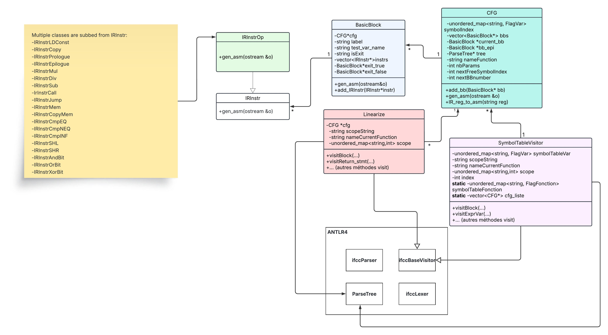

# C Compiler with ANTLR4/C++

This project implements a compiler for a subset of the C language. It processes C source files through several compilation stages:
1. Parsing the source code
2. Building an Abstract Syntax Tree (AST)
3. Creating an Intermediate Representation (IR)
4. Generating x86-64 assembly code

The compiler uses ANTLR4 for lexical analysis and parsing. We implement a symbol table for variable management and construct a Control Flow Graph (CFG) to represent the program as basic blocks containing IR instructions.

## Supported Features

Our compiler supports:

### Variables and Constants
- Variable declarations and assignments
- Constant values

### Static Arrays
- Fixed-size array declarations
- Array initialization with value sequences
- Element access by index

### Arithmetic Operations
- Addition (+)
- Subtraction (-)
- Multiplication (*)
- Division (/)
- Modulo (%)

### Logical and Binary Operations
- Logical AND (&&)
- Logical OR (||)
- Logical XOR (^)
- Comparison operators (<, >, >=, <=, ==, !=)
- Bit shifting (<<, >>)

### Control Flow
- if, if-else, else-if statements
- while loops
- for loops

### Functions
- Function declarations
- Function calls
- Return statements (allowed anywhere)

### Scopes
- Full support for variable scoping rules

## Expression Evaluation Semantics

Our compiler implements a specific approach to expression evaluation that differs from GCC in certain cases. It's important to understand this distinction:

### Assignment in Complex Expressions

GCC evaluates assignments from right to left, treating everything on the left of the assignment operator as an lvalue. Attempting to modify variables directly within expressions can lead to undefined behavior.

For example, in an expression like:
```c
(a=1) || (b=2)
```

Our compiler evaluates this as two separate assignments combined with the logical OR operator, which is the intuitive reading.

Meanwhile, GCC interprets it differently, essentially as:
```c
(a=1 || b) = 2
```

This difference can lead to unexpected results when porting code between compilers.

### Lvalue Considerations

In our implementation:
- Each variable on the left side of an assignment is treated as an lvalue
- We follow traditional C semantics for most operations
- Be aware of this difference when writing expressions that combine assignments with other operations

## Getting Started

### Prerequisites

Before building the compiler, install ANTLR4 using either:
- Your distribution's package manager
- The provided shell script: `install-antlr.sh`

### Build Instructions

Use the provided `Makefile` to build the project. The Makefile includes configuration settings for ANTLR4 in a separate `.mk` file. You may need to modify these variables to match your ANTLR4 installation:
- `ANTLR`: Path to the ANTLR tool
- `ANTLRJAR`: Path to the ANTLR JAR file
- `ANTLRINC`: Path to ANTLR include directory
- `ANTLRLIB`: Path to ANTLR library directory

### Project Structure


### Usage

After building the compiler, you can use it to compile C source files:

```
./ifcc [input_file.c] > [output_file.s]
```

The generated assembly code can then be assembled and linked using standard tools.

## Testing Tool

We provide a comprehensive testing framework to verify our compiler's behavior and performance. Test cases are organized by context in the `testfiles` folder.

### Running Tests

After compiling the program, you can run tests using the following commands:

#### Run all tests:
```
cd tests
python3 ifcc-test.py testfiles
```

#### Run tests for a specific category:
```
python3 ifcc-test.py testfiles/test_if_else
```

#### Run a specific test file:
```
python3 ifcc-test.py testfiles/test_if_else/5_if_double_comp_ou.c
```

### Test Output

The testing tool generates multiple output files in the `ifcc-test-output` directory:
- Assembly code generated by both GCC and our IFCC compiler
- `gcc-compile.txt` and `ifcc-compile.txt`: Compilation messages
- `gcc-execute.txt` and `ifcc-execute.txt`: Execution outputs and return values

This allows for easy comparison between our compiler and the GCC reference implementation.

## Examples

The compiler can handle programs ranging from simple to complex within the supported feature set:

Simple program:
```c
int main() {
   return 42;
}
```

More complex program:
```c
int factorial(int n) {
    if (n <= 1) {
        return 1;
    }
    return n * factorial(n-1);
}

int main() {
    int result = factorial(5);
    return result;
}
```
